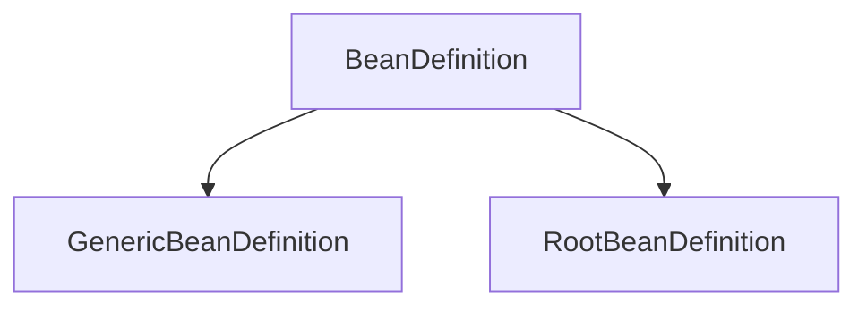
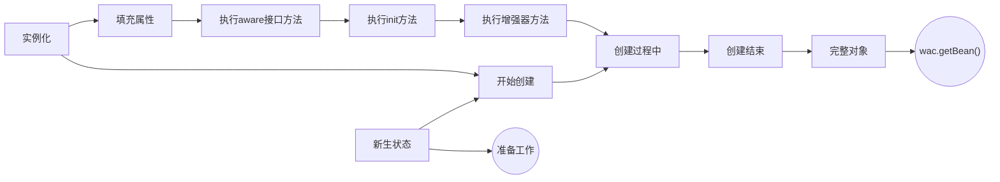

- ConversionService

- EmbeddedValueResolver

- preInstantiateSingletons()
  - getMergedLocalBeanDefinition()
    - invokeBeanFactoryBeanPostProcessor()
  - isFactoryBean()

- doGetBean( )
  - getObjectForBeanInstance()
  - createBean()
    - prepareMethodOverrides()
    - doCreateBean()
      - AbstractAutowireCapableBeanFactory#getInstanceSupplier()

## 创建对象的方法
- 自定义BeanPostProcessor 实际是通过InstantiationAwareBeanPostProcessor
- ！！reflect
- factoryMethod
- FactoryBean
- supplier

